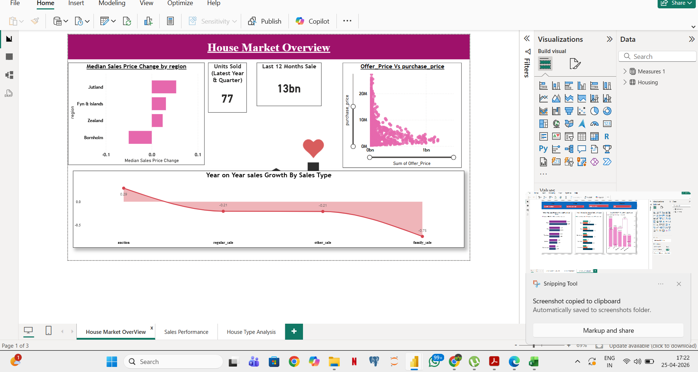
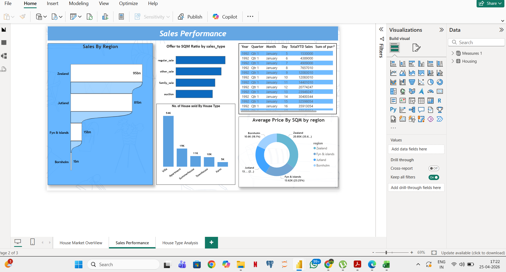
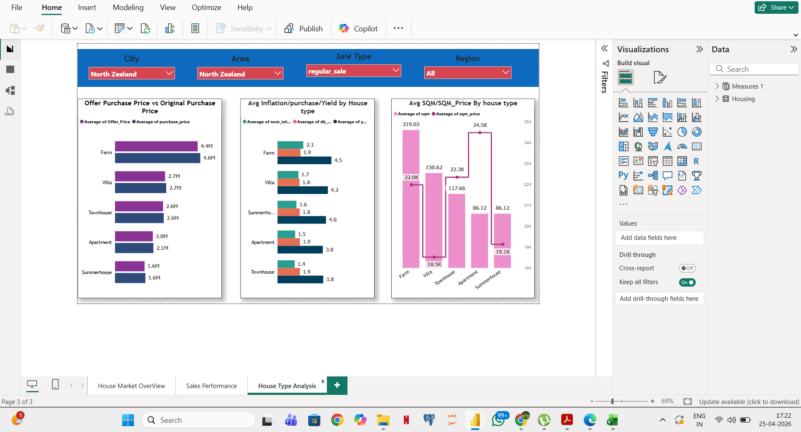

# 📊 House Market Analysis Dashboard

## 🔍 Project Overview
This project analyzes housing market data using Power BI to understand sales trends and pricing behavior across different regions.

## 🛠 Tools Used
- Power BI  
- SQL (BigQuery)  
- DAX  
- Power Query  

## 📈 Key Features
- Sales Performance Dashboard  
- Region-wise Analysis  
- Offer Price vs Purchase Price Comparison  
- Year-over-Year (YOY) Growth Analysis  

## 📊 Key Insights
- Zealand has the highest sales contribution  
- Villas are the most expensive property type  
- Property prices vary significantly by region  
- Clear difference between offer and purchase prices  

## 📸 Dashboard Screenshots

### 📍 Overview Dashboard

### 📍 Sales Performance

### 📍 House Type Analysis

## 📁 Files Included
- Power BI Dashboard (.pbix)  
- Dataset  
- Screenshots  
 
